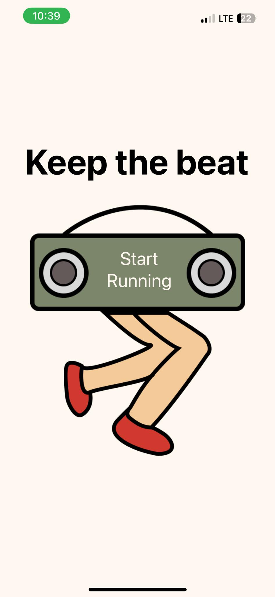
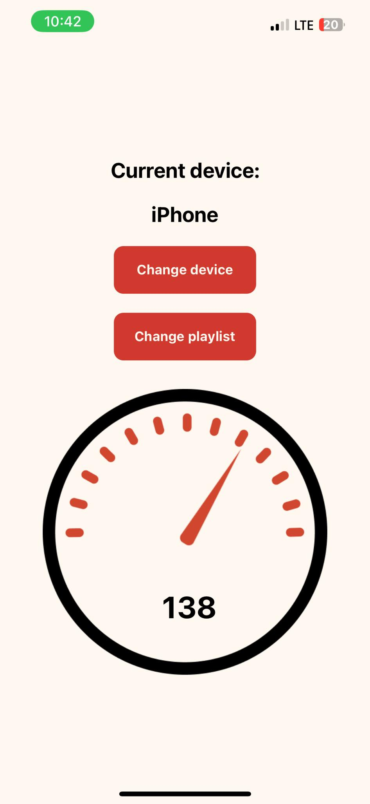

# Keep The Beat
Native app that measures your running cadence using accelerometer. This cadence is then used to pick a song with suitable bpm. As a result, music can help you with keeping your running pace.

# Tech stack: 
- React Native
- TypeScript
- Expo
- Spotify Api
